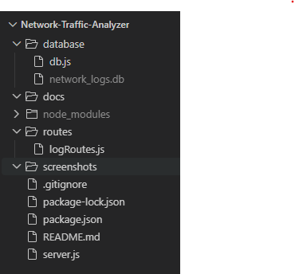
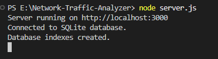
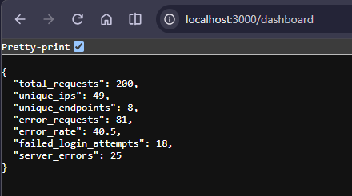
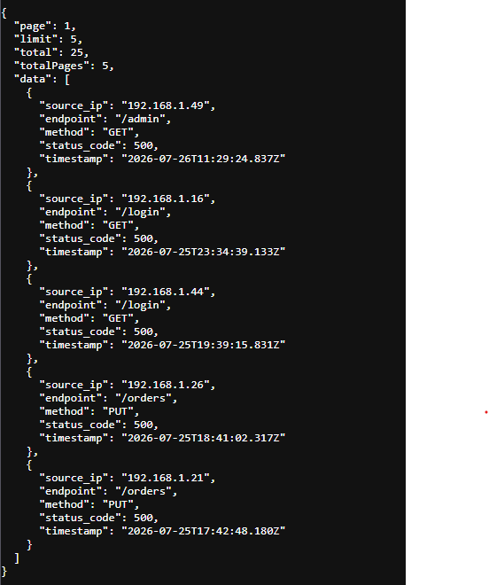
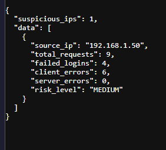
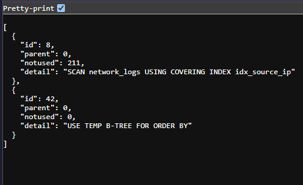

# 🔍 Network Traffic Analyzer

A backend analytics system for analyzing network traffic logs using **Node.js, Express.js, SQLite, and SQL**.

The project processes server request logs and exposes REST APIs for traffic analysis, error monitoring, security insights, dynamic filtering, pagination, and database query optimization.

This project started as a SQL/backend practice project and was extended into a more complete backend analytics application with security-oriented analysis and database performance features.

---

## 📌 Table of Contents

- [Project Overview](#-project-overview)
- [Features](#-features)
- [Tech Stack](#️-tech-stack)
- [Architecture](#️-architecture)
- [Database Schema](#️-database-schema)
- [API Endpoints](#-api-endpoints)
- [Advanced APIs](#-advanced-apis)
- [SQL Concepts Demonstrated](#-sql-concepts-demonstrated)
- [Security Analytics](#-security-analytics)
- [Database Optimization](#-database-optimization)
- [Project Structure](#-project-structure)
- [Running the Project](#️-running-the-project)
- [Example API Requests](#-example-api-requests)
- [Screenshots](#-screenshots)
- [Learning Outcomes](#-learning-outcomes)
- [Future Improvements](#-future-improvements)
- [Author](#-author)

---

## 🚀 Project Overview

Modern applications generate large volumes of server logs containing information about:

- Source IP addresses
- API endpoints
- HTTP methods
- HTTP response status codes
- Request timestamps

Reading these logs manually makes it difficult to identify traffic patterns, errors, and potentially suspicious activity.

The **Network Traffic Analyzer** provides backend APIs that transform raw network logs into useful operational and security insights.

The application uses SQLite as the relational database and Express.js to expose REST APIs that execute analytical SQL queries.

---

## ✨ Features

### 📊 Network Traffic Analytics

- Retrieve all network logs
- Rank source IP addresses by request volume
- Identify the most accessed API endpoints
- Analyze HTTP method usage
- Detect repeated failed login attempts
- Identify endpoints producing HTTP 500 errors
- Analyze traffic patterns
- Summarize HTTP status codes
- Identify IPs generating large numbers of errors

### ⚙️ Backend Features

- RESTful API architecture using Express.js
- Dynamic log filtering
- Pagination using SQL `LIMIT` and `OFFSET`
- Combined filtering and pagination
- Dashboard analytics
- Suspicious IP detection
- Security risk classification
- Parameterized SQL queries
- Input validation
- JSON API responses

### ⚡ Database Optimization

- SQLite indexes
- Query execution analysis
- `EXPLAIN QUERY PLAN`
- Conditional aggregation
- Efficient analytical SQL queries

---

## 🛠️ Tech Stack

| Technology | Purpose |
|---|---|
| **Node.js** | Backend runtime |
| **Express.js** | REST API framework |
| **SQLite** | Relational database |
| **JavaScript** | Backend implementation |
| **SQL** | Data querying and analytics |
| **Git** | Version control |
| **GitHub** | Source code hosting |

---

## 🏗️ Architecture

```text
                     Client / Browser
                            │
                            ▼
                   Express.js REST API
                            │
                            ▼
                      Route Layer
                            │
                            ▼
                       SQLite DB
                            │
          ┌─────────────────┼─────────────────┐
          ▼                 ▼                 ▼
   Traffic Analytics   Security Analytics   Optimization
          │                 │                 │
          ▼                 ▼                 ▼
     SQL Queries       Suspicious IPs    Indexes / Query Plan
```

The backend follows a simple route-driven architecture:

```text
Request
   ↓
Express Router
   ↓
SQL Query
   ↓
SQLite Database
   ↓
JSON Response
```

---

## 🗄️ Database Schema

The application uses a `network_logs` table.

| Column | Type | Description |
|---|---|---|
| `id` | INTEGER | Primary key |
| `source_ip` | TEXT | IP address making the request |
| `endpoint` | TEXT | API endpoint accessed |
| `method` | TEXT | HTTP request method |
| `status_code` | INTEGER | HTTP response status code |
| `timestamp` | TEXT | Request timestamp |

### Sample data characteristics

The application generates realistic sample network traffic containing:

- Multiple source IP addresses
- Common API endpoints such as `/login`, `/products`, `/orders`, `/checkout`, etc.
- HTTP methods such as `GET`, `POST`, and `PUT`
- HTTP status codes including `200`, `401`, `404`, and `500`
- Timestamps distributed across recent traffic history

The database is created and populated automatically when the database is empty.

---

# 🔌 API Endpoints

## 1. Get All Logs

```http
GET /all-logs
```

Returns all network logs sorted from oldest to newest.

### Example

```text
http://localhost:3000/all-logs
```

---

## 2. Top Source IPs

```http
GET /top-ips
```

Returns the top 5 source IP addresses by number of requests.

### SQL concepts

- `COUNT`
- `GROUP BY`
- `ORDER BY`
- `LIMIT`

### Example

```text
http://localhost:3000/top-ips
```

---

## 3. Most Accessed Endpoints

```http
GET /endpoints
```

Returns the top 5 most frequently accessed API endpoints.

### SQL concepts

- `COUNT`
- `GROUP BY`
- `ORDER BY`
- `LIMIT`

### Example

```text
http://localhost:3000/endpoints
```

---

## 4. Failed Login Detection

```http
GET /failed-logins
```

Identifies source IPs with more than two failed login attempts using HTTP status `401`.

### SQL concepts

- `COUNT`
- `GROUP BY`
- `HAVING`
- `ORDER BY`

### Example

```text
http://localhost:3000/failed-logins
```

---

## 5. Server Error Endpoints

```http
GET /server-errors
```

Finds endpoints that returned HTTP `500` and counts the number of server errors.

### Example

```text
http://localhost:3000/server-errors
```

---

## 6. HTTP Method Usage

```http
GET /methods-usage
```

Counts the number of requests made using each HTTP method.

### Example

```text
http://localhost:3000/methods-usage
```

---

## 7. Status Summary

```http
GET /status-summary
```

Provides a summary of HTTP response status codes.

### Example

```text
http://localhost:3000/status-summary
```

---

## 8. Top Error IPs

```http
GET /top-error-ips
```

Identifies source IPs responsible for a high number of error responses.

### Example

```text
http://localhost:3000/top-error-ips
```

---

## 9. Traffic by Hour

```http
GET /traffic-by-hour
```

Analyzes network request volume based on request time.

### Example

```text
http://localhost:3000/traffic-by-hour
```

---

# 🔎 Advanced APIs

## 10. Dynamic Log Filtering

```http
GET /logs
```

The `/logs` endpoint supports dynamic filtering by:

- IP address
- HTTP status code
- HTTP method
- API endpoint

### Filter by IP

```text
/logs?ip=192.168.1.10
```

### Filter by status

```text
/logs?status=500
```

### Filter by method

```text
/logs?method=POST
```

### Filter by endpoint

```text
/logs?endpoint=/login
```

### Combine filters

```text
/logs?status=500&method=POST
```

The API uses parameterized SQL queries rather than directly concatenating user input into SQL statements.

---

## 📄 11. Pagination

The `/logs` endpoint also supports pagination.

```text
/logs?page=1&limit=10
```

Example response:

```json
{
  "page": 1,
  "limit": 10,
  "total": 200,
  "totalPages": 20,
  "data": []
}
```

The pagination logic uses:

```sql
LIMIT ?
OFFSET ?
```

with:

```text
offset = (page - 1) × limit
```

The API validates pagination parameters and restricts the maximum page size.

### Filtering + Pagination

Filters can be combined with pagination:

```text
/logs?status=500&page=1&limit=5
```

This allows clients to retrieve only the required subset of matching logs.

---

# 📈 12. Dashboard Analytics

```http
GET /dashboard
```

The dashboard endpoint combines several SQL metrics into a single response.

### Metrics

- Total requests
- Unique IP addresses
- Unique endpoints
- Total error requests
- Error rate
- Failed login attempts
- Server errors

### Example

```json
{
  "total_requests": 200,
  "unique_ips": 48,
  "unique_endpoints": 8,
  "error_requests": 42,
  "error_rate": 21,
  "failed_login_attempts": 15,
  "server_errors": 14
}
```

The actual values depend on the generated dataset.

---

# 🔐 13. Suspicious IP Detection

```http
GET /security/suspicious-ips
```

This endpoint provides a basic security analytics layer.

Each source IP is analyzed using:

- Total request volume
- Failed login attempts (`401`)
- Client errors (`4xx`)
- Server errors (`5xx`)

IPs are assigned a risk level:

```text
LOW
MEDIUM
HIGH
```

### Example response

```json
{
  "suspicious_ips": 12,
  "data": [
    {
      "source_ip": "192.168.1.17",
      "total_requests": 18,
      "failed_logins": 4,
      "client_errors": 6,
      "server_errors": 1,
      "risk_level": "MEDIUM"
    }
  ]
}
```

The detection logic uses SQL conditional aggregation and `HAVING` to identify suspicious groups.

---

# ⚡ 14. Database Query Plan

```http
GET /query-plan
```

This endpoint exposes SQLite's query execution plan for an analytical query.

The project uses:

```sql
EXPLAIN QUERY PLAN
```

to inspect how SQLite executes the query.

Example output may contain information such as:

```text
USING COVERING INDEX idx_source_ip
```

This provides visibility into whether SQLite is using the indexes created for analytical workloads.

---

# 🧠 SQL Concepts Demonstrated

The project provides practical usage of:

### Basic SQL

```sql
SELECT
WHERE
ORDER BY
```

### Aggregation

```sql
COUNT()
SUM()
```

### Grouping

```sql
GROUP BY
HAVING
```

### Result limiting

```sql
LIMIT
OFFSET
```

### Distinct values

```sql
COUNT(DISTINCT column)
```

### Conditional aggregation

```sql
SUM(
    CASE
        WHEN condition THEN 1
        ELSE 0
    END
)
```

### Parameterized queries

```sql
WHERE source_ip = ?
```

### Database optimization

```sql
CREATE INDEX
EXPLAIN QUERY PLAN
```

---

# 🔐 SQL Injection Prevention

The dynamic `/logs` API uses parameterized queries.

Instead of constructing SQL like:

```javascript
`WHERE source_ip = '${ip}'`
```

the application uses:

```javascript
query += ` AND source_ip = ?`;
params.push(ip);
```

This keeps user-supplied values separate from the SQL statement and helps protect against SQL injection.

---

# ⚡ Database Optimization

Indexes were added to columns frequently used by analytical queries:

```text
source_ip
status_code
endpoint
timestamp
```

The application creates them using:

```sql
CREATE INDEX IF NOT EXISTS ...
```

The project also uses:

```sql
EXPLAIN QUERY PLAN
```

to inspect query execution.

This demonstrates an important backend/database engineering concept:

> Query performance depends not only on writing correct SQL, but also on how the database executes that SQL.

Indexes can improve read performance for frequently queried columns, while also introducing storage and write-maintenance overhead. Therefore, indexes should be selected based on actual query patterns rather than added indiscriminately.

---

# 📁 Project Structure

```text
Network-Traffic-Analyzer/
│
├── database/
│   ├── db.js
│   └── network_logs.db          # Generated locally; ignored by Git
│
├── routes/
│   └── logRoutes.js
│
├── screenshots/
│   ├── project-structure.png
│   ├── server-running.png
│   ├── dashboard.png
│   ├── filtering-pagination.png
│   ├── suspicious-ips.png
│   └── query-plan.png
│
├── .gitignore
├── package.json
├── package-lock.json
├── README.md
└── server.js
```

> `node_modules/` and generated SQLite database files are excluded from version control through `.gitignore`.

---

# ▶️ Running the Project

## Prerequisites

Install:

- Node.js
- npm
- Git

You do not need to install the SQLite command-line utility because the project uses the Node.js `sqlite3` package.

---

## 1. Clone the repository

```bash
git clone https://github.com/sanyuktaaut09/network-traffic-analyzer.git
```

---

## 2. Navigate into the project

```bash
cd network-traffic-analyzer
```

---

## 3. Install dependencies

```bash
npm install
```

This installs the dependencies defined in `package.json`.

---

## 4. Start the server

```bash
node server.js
```

Expected output:

```text
Connected to SQLite database.
Database indexes created.
Server running on http://localhost:3000
```

---

## 5. Open the API

Open:

```text
http://localhost:3000
```

You should see:

```text
Network Traffic Analyzer API is Running 🚀
```

---

# 🧪 Example API Requests

Once the server is running, these URLs can be tested directly in a browser.

### All logs

```text
http://localhost:3000/all-logs
```

### Top IPs

```text
http://localhost:3000/top-ips
```

### Most accessed endpoints

```text
http://localhost:3000/endpoints
```

### Failed logins

```text
http://localhost:3000/failed-logins
```

### Server errors

```text
http://localhost:3000/server-errors
```

### HTTP methods

```text
http://localhost:3000/methods-usage
```

### Dashboard

```text
http://localhost:3000/dashboard
```

### Filtered logs

```text
http://localhost:3000/logs?status=500&page=1&limit=5
```

### Suspicious IPs

```text
http://localhost:3000/security/suspicious-ips
```

### Query plan

```text
http://localhost:3000/query-plan
```

---

# 📸 Screenshots

The repository includes screenshots demonstrating the major project components.

## Project Structure



Shows the organization of the backend, database, routes, and supporting files.

---

## Server Running



Shows the Express server successfully connecting to SQLite and starting on port `3000`.

---

## Dashboard Analytics



Shows the combined network traffic and error metrics returned by the dashboard API.

---

## Filtering and Pagination



Demonstrates dynamic filtering of logs together with pagination.

---

## Suspicious IP Detection



Shows the security analytics endpoint and risk classification for suspicious IP addresses.

---

## SQL Query Plan



Shows SQLite's `EXPLAIN QUERY PLAN` output and index usage.

---

# 🎯 Learning Outcomes

This project provided practical experience with:

- Node.js backend development
- Express.js REST APIs
- SQLite database integration
- SQL aggregation
- `GROUP BY` and `HAVING`
- Conditional aggregation
- Dynamic filtering
- Pagination
- Parameterized SQL queries
- Input validation
- Security-oriented log analysis
- Database indexing
- Query execution plans
- Git and GitHub workflows

---

# 🔮 Future Improvements

Potential future enhancements include:

- JWT-based authentication
- Role-based access control
- Rate limiting
- Redis caching for frequently requested analytics
- Background log processing using Kafka or RabbitMQ
- Real-time traffic monitoring
- WebSocket-based live dashboard
- PostgreSQL support for larger datasets
- Automated unit and integration tests
- Docker containerization
- CI/CD pipeline
- Production deployment
- Frontend monitoring dashboard with charts

---

# 📌 Project Highlights

The project demonstrates the progression from basic SQL queries to a more complete backend analytics system:

```text
Raw Network Logs
       ↓
SQL Aggregation
       ↓
REST APIs
       ↓
Filtering & Pagination
       ↓
Dashboard Analytics
       ↓
Security Analytics
       ↓
Database Indexing
       ↓
Query Plan Analysis
```

---

# 👩‍💻 Author

## Sanyukta Raut

GitHub:  
https://github.com/sanyuktaaut09

Repository:  
https://github.com/sanyuktaaut09/network-traffic-analyzer

---

## ⭐ Summary

**Network Traffic Analyzer** is a Node.js and SQLite backend project that demonstrates practical SQL analytics, REST API development, security-oriented log analysis, pagination, dynamic filtering, and database performance optimization.
